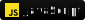

<h1  align="center">
    Hello Word! I'm Matheus Henrique
</h1>

---

## 👤 Who am I?

- 🇧🇷 Based in Aparecida de Goiânia, Brazil

- 💀🔪 Served 8 years as a Corporal in the Brazilian Army in special operations  
  - *learned discipline, proactivity, focus and responsibility*

- 💻 Systems Analysis and Development Student (5th Semester) → transitioning into Software Development & InfoSec

- 🎶 Musician at heart → I apply the resilience learned from music to the structure of my code

- 🎯 Mission: Build secure and impactful projects that combine technology, data science, and mobile innovation

## ⚔️ Tech Arsenal

### Language & Frameworks

  
  
  
  
  
  

<!-- editar icone postgree ok 
colocar icones em cada linha (quebra de linha)
-->

### 🛠 Tools & Plataforms

  
  

### 💻 IDEs & Workflow

  
---

## 🏆 Project that define me  

[Counters](https://github.com/mhenriquers/Counters) → An interactive counter guide for Mobile Legends: Bang Bang. Developed to help players to choose the best hero during the draft phase. 

## 🌐Conect with me

<a href="https://www.linkedin.com/in/matheus-henrique-68662534b/" target="_blank">
    

## ⚡ Final Note

>*Resilience, discipline, and a mission-oriented mindset — these are the pillars I bring from my military service. Today, I translate this commitment into building high-quality, precise, and secure code.*

    

