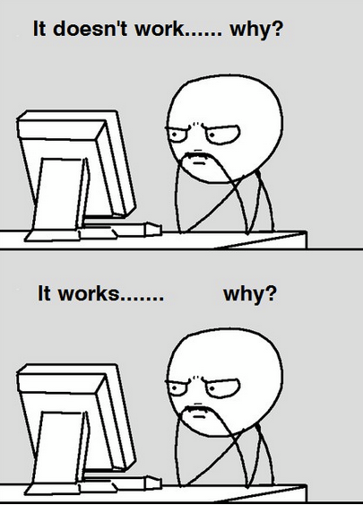

<h1  align="center">
    Hello World! I'm Matheus Henrique
</h1>

## 

## 👤 Who am I?

- 🇧🇷 Based in Aparecida de Goiânia, Brazil

- 💀🔪 Served 8 years as a Corporal in the Brazilian Army in a Special Operations Battalion
  - _learned discipline, proactivity, focus and responsibility_

- 💻 Systems Analysis and Development Student (5th Semester) → transitioning into Software Development & InfoSec

- 🎶 Musician at heart → I apply the resilience learned from music to the structure of my code

- 🎯 Mission: Build secure and impactful projects that combine technology, data science, and mobile innovation

## ⚔️ Tech Arsenal

### Language & Frameworks

<!--https://img.shields.io/badge/<TEXTO>-<COR_DE_FUNDO>?style=<ESTILO>&labelColor=<COR_DO_LABEL>&color=<COR_DO_TEXTO>&logo=<LOGO>&logoColor=<COR_DO_LOGO>-->

### 🛠 Tools & Plataforms

### 💻 IDEs & Workflow

## 🏆 Project that defines me

 → An interactive counter guide for Mobile Legends: Bang Bang. Developed to help players to choose the best hero during the draft phase.

<!--https://img.shields.io/badge/<TEXTO>-<COR_DE_FUNDO>?style=<ESTILO>&labelColor=<COR_DO_LABEL>&color=<COR_DO_TEXTO>&logo=<LOGO>&logoColor=<COR_DO_LOGO>-->
## Commits

<!--

-->

## 🌐Conect with me

<!--

-->
## ⚡ Final Note

> _Resilience, discipline, and a mission-oriented mindset — these are the pillars I bring from my military service. Today, I translate this commitment into building high-quality, precise, and secure code._

    

